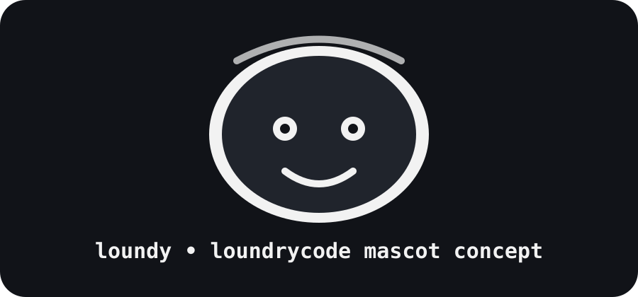
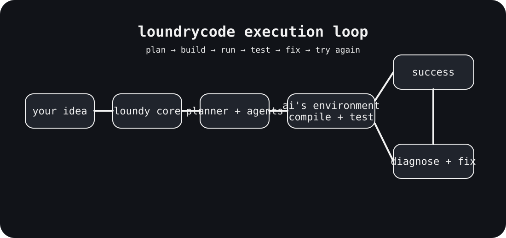

# loundrycode

> throw in your messy ideas and loundrycode can turn that messy idea of yours to life! 🧺✨

loundrycode is a native-first ai app coder for ios. it is designed around one simple idea: **describe what you want, then let the system do the heavy lifting.**

instead of making you assemble a giant pile of tools yourself, loundrycode aims to bring planning, coding, project generation, execution, testing, and iteration into one place.

> ⚠️ **the loundy department has one request:** please do not make your idea *too* messy. loundy is self aware of what they do. 👀



## 🚧 project status

**v0.3.0 • native ios app shell + unsigned ipa pipeline**

v0.3 keeps that foundation and adds the first native ios app shell, a vibrant swiftui interface, a code-driven spinning loundy mascot, svg visual assets, and a github actions pipeline that packages an unsigned ipa for sidestore.

## 📱 v0.3 ios app\n\nthe v0.3 app is a native swiftui shell with a bright gradient interface, idea composer, loundy mascot, and an **ai's environment** surface for the future terminal/execution layer.\n\nfor device installation, github actions archives the app with code signing disabled and packages it as `loundrycode-unsigned.ipa`. sidestore can then handle signing on the device.\n\nvisual branding assets and icons live as `.svg` files under `Sources/LoundryApp/Assets/`.\n\n## 🧺 what is loundrycode?

loundrycode is intended to be an **ai-powered app development environment for ios** that hides as much unnecessary complexity as possible without hiding what the ai is actually doing.

at the surface, the experience should stay extremely simple:

1. describe an idea
2. loundrycode plans it
3. loundy and the ai agents build it
4. the environment runs the project
5. the project is compiled and tested
6. failures are diagnosed and fixed
7. the result comes back to you

underneath that clean interface is a much larger system containing model providers, agents, project systems, runtimes, compilers, environment adapters, execution services, and more.

## 🧠 the core idea

loundrycode is not meant to be just a chat box with a code generator stapled onto it.

its long-term architecture is closer to an **ai software workshop**:

```text
                    your idea
                       │
                       ▼
                 ┌───────────┐
                 │  loundy   │
                 │   core    │
                 └─────┬─────┘
                       │
                       ▼
                 ┌───────────┐
                 │  planner  │
                 └─────┬─────┘
                       │
                       ▼
              ┌─────────────────┐
              │ model + agents  │
              └────────┬────────┘
                       │
                       ▼
              ┌─────────────────┐
              │ ai's environment│
              └────────┬────────┘
                       │
                compile + test
                       │
                  ┌────┴────┐
                  │         │
                works     fails
                  │         │
                  │    diagnose/fix
                  │         │
                  └────┬────┘
                       ▼
                    result
```



## 🧩 polyglot by design

**loundrycode itself is polyglot.** there is no required implementation language for the entire product.

each subsystem can use whatever language and runtime actually fits its job. the important part is the contract between components, not the language behind that contract.

for example:

```text
loundrycode
│
├── ios ui              → swift / swiftui
├── web ui              → typescript / react
├── orchestration      → rust / go / c++ / ...
├── agents             → python / rust / typescript / ...
├── model adapters      → whatever fits the provider
├── execution runner    → rust / go / native tooling
├── windows tooling     → c# / c++ / rust / ...
├── linux tooling       → rust / go / native tooling
└── utilities           → whatever fits
```

these are examples, not hard requirements. a component can be rewritten in another language without changing the overall architecture as long as its contract remains compatible.

### language-neutral contracts

components communicate through explicit contracts for things such as:

- projects and manifests
- model requests and streamed responses
- environment commands and results
- build plans and diagnostics
- activity events
- capabilities

those contracts can be represented through language-specific adapters, but the architecture does not depend on swift, rust, python, typescript, or any other single language.

see [`docs/polyglot-architecture.md`](docs/polyglot-architecture.md) and [`contracts/README.md`](contracts/README.md).

## 🖥️ ai's environment

one of the biggest ideas in loundrycode is **ai's environment**.

when the ai needs to actually build something, it should have access to a real execution environment rather than a pretend terminal animation.

that means the environment can contain things such as:

- a filesystem
- a shell
- source files
- package managers
- runtimes
- compilers
- build tools
- processes
- test runners
- logs
- artifacts

for example, an agent could request a command like `npm install` through the environment abstraction without needing to hard-code whether the underlying machine uses windows, linux, or another supported system.

### environment targets

loundrycode is designed to eventually support environments ranging from windows to linux, with other environments possible through adapters.

conceptually, an environment can be described as:

```text
operating system
      +
shell
      +
filesystem
      +
runtimes
      +
compilers
      +
packages
      +
processes
      =
ai's environment
```

this abstraction is important because loundrycode should not depend on one giant computer sitting in a mysterious warehouse somewhere. ☁️🖥️

## 🤖 ai orchestration

loundrycode itself is intended to act as the **orchestrator**.

rather than assuming one model can do everything, the system can coordinate specialized agents and model providers.

possible responsibilities include:

- understanding the user's request
- turning an idea into a project plan
- generating and editing files
- delegating subtasks
- selecting tools
- running commands
- compiling projects
- executing tests
- inspecting failures
- applying fixes
- retrying failed work
- presenting useful progress to the user

v0.2 now contains the first implementation of this flow through `loundrycore`, including a model-provider abstraction, project planner, environment execution, and repair loop.

## 👀 visible ai activity

loundrycode should make ai work **visible without exposing private chain-of-thought**.

there will be a visible thinking/processing experience that can communicate high-level activity such as understanding the request, planning architecture, generating files, installing dependencies, compiling, running tests, diagnosing an error, applying a fix, and trying again.

v0.2 provides the structured `activityevent` stream that the future ios ui can consume.

## ✖️ the extra menu

loundrycode is planned to have a small, detailed x-style action button that opens additional tools and views.

one of the important entries is:

**ai's environment**

that view is intended to let you watch the actual execution environment doing its work: terminals, files, builds, processes, logs, and tests.

## 🧺 unorthodox

**unorthodox** is the more powerful version of the loundrycode experience.

it is intended to provide stronger models, stronger subagents, more aggressive ai workflows, some additional visual polish, and more compute capacity.

there are **no credits** in loundrycode. usage is intended to refresh over time rather than becoming a credit vending machine.

## 📱 ios-first

loundrycode is being designed around an ios-first experience. that means the interface should be designed for touch, small screens, and fast interactions.

other platform shells can exist alongside the ios application. the ios shell does not dictate the implementation language of the rest of the product.

## 🏗️ repository architecture

an early conceptual repository layout looks like this:

```text
loundrycode/
├── app/                    # platform-facing applications
│   ├── ios/                # native ios shell
│   ├── macos/              # native macos shell when needed
│   └── web/                # web shell when needed
├── components/             # independently implementable product systems
│   ├── orchestration/
│   ├── agents/
│   ├── model-adapters/
│   ├── execution/
│   └── project-system/
├── contracts/              # language-neutral public boundaries
├── environments/            # environment adapters and runners
│   ├── linux/
│   ├── windows/
│   └── macos/
├── runtimes/               # runtime/toolchain integrations
├── backend/                # deployable backend services
├── docs/
│   └── assets/
└── .github/                # construction/release system for loundrycode
    └── workflows/
```

this is a direction, not a claim that every directory already exists.

## 🏗️ github actions boundary

github actions is the **construction crew for loundrycode itself**.

it builds, tests, packages, and releases the loundrycode product. it is **not** loundrycode's runtime worker and should not become the backend that builds every user project.

user-generated projects execute through loundrycode's own environment abstraction. that abstraction can later be backed by local sandboxes, containers, virtual machines, hosted workers, or other compatible infrastructure.

## 🧪 development philosophy

### simple outside, huge inside

the user interface should feel small and understandable even if the backend is enormous.

### real tools, not fake theater

when the ai says it is building or testing something, the goal is for real execution to happen somewhere appropriate.

### polyglot by design

use the right language for each subsystem. keep boundaries stable and implementation details replaceable.

### no credit treadmill

usage limits may exist where compute has a real cost, but the product should not revolve around artificial little coins.

### visible progress

users should understand what the system is currently doing without being shown private chain-of-thought.

### fail, learn, retry

build errors are part of software development. loundrycode should diagnose failures and try useful fixes instead of immediately giving up.

## 🚀 development roadmap

### phase 0: foundation

- [x] repository created
- [x] project direction documented
- [x] gitignore added
- [x] language-neutral architecture documented
- [x] polyglot component boundary documented
- [x] project/environment/model contracts established
- [x] initial orchestration logic
- [x] build retry path
- [x] capability-aware planning
- [x] structured build diagnostics
- [ ] ios application shell
- [ ] initial loundy onboarding

### phase 1: first working builder

- [ ] project creation ui
- [x] basic ai provider interface
- [ ] agent/tool system
- [x] filesystem operations
- [x] terminal environment abstraction
- [x] local execution adapter
- [ ] linux execution environment
- [ ] build/test loop with real diagnostics
- [x] retry handling

### phase 2: ai's environment

- [ ] real environment viewer
- [ ] live terminal output
- [ ] process visibility
- [ ] build logs
- [ ] test results
- [ ] generated artifacts

### phase 3: bigger workshop

- [ ] additional operating system adapters
- [ ] more runtimes
- [ ] more compilers
- [ ] remote execution backends
- [ ] richer subagent orchestration
- [ ] provider expansion

### phase 4: unorthodox

- [ ] stronger model routing
- [ ] stronger subagents
- [ ] expanded compute capacity
- [ ] rolling usage system
- [ ] additional visual polish

## 🔐 privacy and credentials

loundrycode should treat credentials and provider keys as sensitive configuration.

secrets, local environment files, generated build artifacts, caches, and machine-specific configuration should not be committed to the repository.

providers and execution backends should be designed so that credentials can remain on the appropriate side of the connection instead of becoming part of the source tree.

## 📦 contributing

this project is currently in a very early stage, so the architecture may change substantially as implementation begins.

when contributing, prefer small, understandable changes and keep the public interface simple. if a feature makes the system dramatically more complicated, it should have a good reason to exist.

## 📄 license

loundrycode is released under the license included in this repository.

## 🧺 the short version

**loundrycode takes messy ideas and tries to turn them into working software.**

simple interface. huge machinery underneath. real environments. ai agents. compilation. testing. retries. and a tiny spinning head named loundy watching the whole thing happen.

welcome to the laundry. 🧺🤖✨
